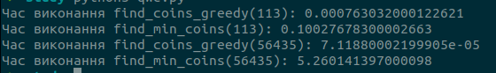

Порвіняємо два алгоритми:

Жадібний алгоритм має складність O(n), де n - сума, яку потрібно видати. Динамічне програмування має складність O(n * m), де n - сума, а m - кількість номіналів монет.

Після запуску програми, отримаємо наступні результати

З цього можна зробити висновок, що жадібний алгоритм набагто ефективніший за алгоритм динамічного програмування, але якщо сума доволі велика, то тоді алгоритм динамічного програмування більш ефективний.